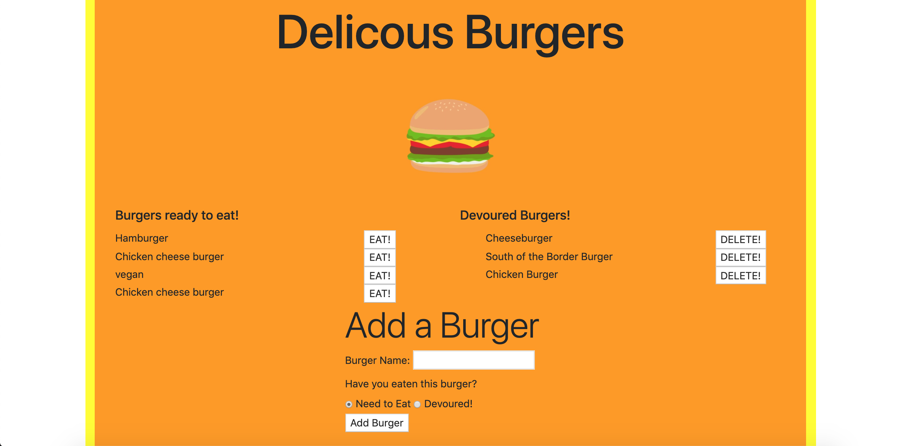

# Sequelize Burger Tracker

## Description

This is a burger logger using MySQL, Node, Express, Handlebars and a homemade ORM. Functionality for this application include letting users input the names of burgers they'd like to eat. Whenever a user submits a burger's name, the app will display the burger on the left side of the page -- waiting to be devoured. Each burger in the waiting area also has a Devour it! button. When the user clicks it, the burger will move to the right side of the page. The app will store every burger in a database, whether devoured or not.

This is similar to the Burger logger that I have done before, but this time we are using sequelize to retrieve the data. Sequelize shortens the queries so that it is more user friendly and easier to type.

## Table of Contents

* [Installation](#installation)
* [Usage](#usage)
* [Credits](#credits)
* [License](#license)

## Installation
1. Clone the github repo
2. Run server in the terminal

## Usage 
On this application, the user has a list of burgers that they have eaten and not eaten. Then can move the not eaten burgers to eaten with a click of a button then deleting them afterwards. The user can also create burgers and have the option of choosing if its eaten.

Go to link: https://burgerloggerhl.herokuapp.com/

## Credits

Thanks to UW Coding Boot Camp and our instructor Joe for guiding me through the process. Also, thank you to the TAs Clint and Denis who are there everyday to help.

W3school for many of their online references.
https://www.w3schools.com/ 

Bootstrap Code
https://getbootstrap.com/

## License

Attribution-ShareAlike 4.0 International

=======================================================================
